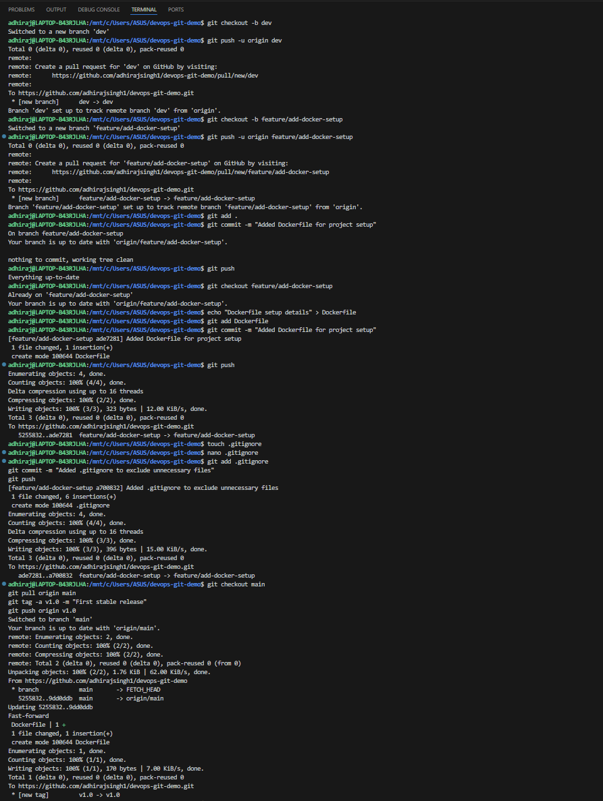

# devops-git-demo

## Overview
This project demonstrates Git best practices for a DevOps workflow, including branching, pull requests, version control, and documentation.

---

## Steps Performed

### 1. Initialized Git Repository
- Created a new project folder.
- Initialized Git with `git init`.
- Added a `README.md` file.
- Made the first commit and pushed it to the `main` branch on GitHub.

### 2. Created Branches
- Created a `dev` branch from `main` for integration.
- Created a `feature/add-docker-setup` branch from `dev` for new changes.

### 3. Worked on Feature Branch
- Made changes in the feature branch (e.g., added Dockerfile).
- Committed changes with descriptive messages.
- Pushed the feature branch to GitHub.

### 4. Opened Pull Requests
- Created a Pull Request from `feature/add-docker-setup` → `dev`.
- After review, merged changes into `dev`.
- Created a Pull Request from `dev` → `main` to release to production.

### 5. Added `.gitignore`
- Added a `.gitignore` file to exclude unnecessary files (e.g., `__pycache__/`, `node_modules/`, `.env`).
- Committed and pushed it to the repository.

### 6. Tagged a Release
- After merging into `main`, created a tag `v1.0` for the first stable release.
- Pushed the tag to GitHub.

### 7. Documented Tasks
- Created `TASKS.md` to record all actions and changes in markdown format.

---

## Branching Strategy
- **main** → Production-ready code.
- **dev** → Integration branch for tested features.
- **feature/** → Short-lived branches for individual features.

## Git Usage Proof

Below is a screenshot showing the Git commands, branches, commits, merges, and tags used in this project.

